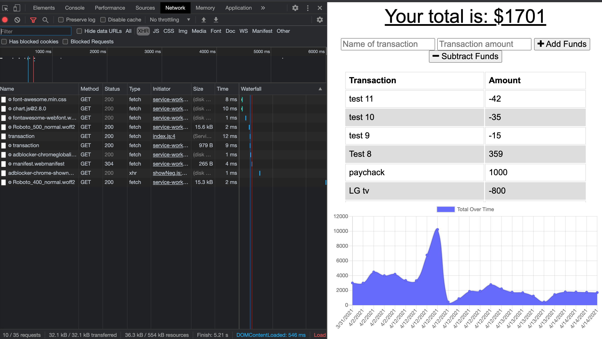
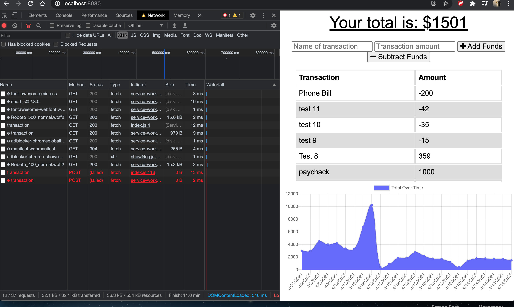

# Budget-Trackers-Online-Offline

by: Jack Funck


## table of Contents:
 - [Link.](#link)
 - [ Description. ](#desc)
 - [ Instructions. ](#instr)
 - [Technologies.](#tc)
 - [Dependencies](#dep)
 - [ Video. ](#video)
 - [Screen-Shots.](#sc)

<a name="link"></a>
## Link
give it a try: <a href="https://fitnesscoolness.herokuapp.com/?id=606b87db9a6228001595c2e2" target="_blank"> Workout Tracker</a>

<a name="desc"></a>
## Description

In this repository, I have built a Budget Tracker application utilizing IndexedDb. The main focus of this unit was Progressive Web Applications (PWA's) and this application allows for online/offline access and functionality. The user will be able to add expenses and deposits to their budget with or without a connection. When entering transactions offline, they should populate the total when brought back online.


<a name="instr"></a>
## Instructions
Either "Click" the heroku([Link.](#link)) above or

Run this command in your Command line
```
node server.js
```
* Type in localhost:8080 in the browser and you will be brought to the home page.


<a name="tc"></a>
## Technologies Used
* Node.js
* JavaScript
* bootstrap
* webmanifest
* mongoDb

<a name="dep"></a>
# Dependencies
* express
* morgan
* mongoose
* manifest


<a name="video"></a>
# Video of how it works.
> If you click GIF you will be navigated to YouTube for a full-video.

[](https://www.youtube.com/watch?v=jQ-yy9_lYAo)


<a name="sc"></a>
# Screen Shots
### online


### offline


